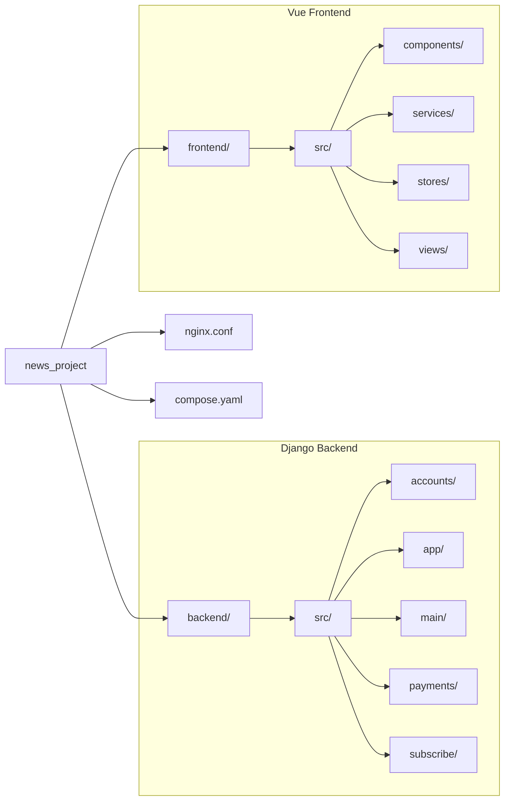

# TechNews Project

A modern, full-featured news platform built with DRF and Vue, featuring subscription management, payment processing, and real-time content delivery.

## 🚀 Features

### Backend
- **User Management**: Custom user authentication with JWT tokens (SimpleJWT)
- **News Articles**: Full CRUD operations with category support and pinning
- **Comments System**: Nested comments with reply functionality
- **Subscription Management**: Tiered plans with automated expiry handling
- **Payment Integration**: Stripe payment processing with webhook support
- **Media Storage**: S3-compatible storage (MinIO) for static and media files
- **Async Tasks**: Celery-based background job processing for maintenance
- **API Documentation**: Interactive Swagger/ReDoc documentation (drf-spectacular)
- **Caching**: Redis-based caching with Django-Cachalot ORM cache
- **Admin Panel**: Enhanced Django admin with import/export functionality

### Frontend
- **Modern UI**: Built with Vue 3 and Tailwind CSS 4
- **State Management**: Robust state handling with Pinia
- **Responsive Design**: Mobile-first approach for all views
- **Interactive Components**: Real-time feedback and smooth transitions
- **Type Safety**: Fully written in TypeScript with auto-generated API types

## 🛠️ Tech Stack

### Backend
- **Framework**: Django 5.2.5
- **API**: Django REST Framework 3.16+
- **Database**: PostgreSQL 17
- **Cache**: Redis 6.4+
- **Task Queue**: Celery 5.5+ with Redis broker
- **Authentication**: JWT (djangorestframework-simplejwt)
- **Payment**: Stripe API
- **Storage**: S3-compatible (MinIO/AWS S3)
- **Server**: Uvicorn ASGI server
- **Package Manager**: uv

### Frontend
- **Framework**: Vue 3.5+
- **Build Tool**: Vite 7.1+
- **Styling**: Tailwind CSS 4.1+
- **State Management**: Pinia 3.0+
- **Routing**: Vue Router 4.6+
- **API Client**: Axios with OpenAPI TypeScript types
- **Icons**: Heroicons

### DevOps & Tools
- **Containerization**: Docker & Docker Compose
- **Reverse Proxy**: Nginx
- **Task Monitoring**: Flower (Celery monitoring)
- **Pre-commit Hooks**: pre-commit
- **Testing**: pytest (backend), vue-tsc (frontend check)
- **Linting**: Ruff/Flake8 (backend), ESLint (frontend)

## 📋 Prerequisites

- **Python 3.12+**
- **Node.js 20+ & npm**
- **Docker & Docker Compose**
- **uv** (Python package manager)
- **PostgreSQL 17** (for local development)
- **Redis** (for local development)

## 🔧 Installation & Setup

### 1. Clone the Repository

```bash
git clone <repository-url>
cd news_project
```

### 2. Environment Configuration

The project uses separate environment files for backend and frontend.

#### Backend
Copy the example environment file in the root and configure it:
```bash
cp .env.example .env
```
Edit `.env` with your configuration (Database, Redis, Stripe, S3).

#### Frontend
Copy the example environment file in `frontend/` and configure it:
```bash
cp frontend/.env.example frontend/.env
```

### 3. Install Dependencies

#### Backend
```bash
cd backend
make deps # or uv sync
```

#### Frontend
```bash
cd frontend
npm install
```

### 4. Run with Docker (Recommended)

From the project root:
```bash
# Build the images
docker compose build

# Start all services
docker compose up -d
```

Services will be available at:
- **Frontend**: http://localhost
- **API**: http://localhost:8000
- **API Documentation**: http://localhost:8000/api/v1/docs/swagger/
- **Admin Panel**: http://localhost:8000/admin/
- **Flower (Celery Monitor)**: http://localhost:5555 (admin:admin)
- **MinIO Console**: http://localhost/s3/ui (user:password)

### 5. Local Development Setup

#### Backend
```bash
cd backend
make prep     # Run migrations
make up       # Start development server
make worker   # Start Celery worker
```

#### Frontend
```bash
cd frontend
npm run dev
```

## 📁 Project Structure

```
news_project/
├── backend/
│   ├── src/
│   │   ├── accounts/          # User management & auth
│   │   ├── app/              # Main Django configuration
│   │   ├── comments/         # Comments system
│   │   ├── main/             # News articles & core
│   │   ├── payments/         # Stripe integration
│   │   └── subscribe/        # Subscription management
│   ├── Dockerfile
│   ├── Makefile
│   └── pyproject.toml
├── frontend/
│   ├── src/
│   │   ├── assets/           # Styles and images
│   │   ├── components/       # Reusable Vue components
│   │   ├── services/         # API service layers
│   │   ├── stores/           # Pinia stores
│   │   └── views/            # Page components
│   ├── Dockerfile
│   ├── package.json
│   └── vite.config.js
├── nginx.conf                # Main Nginx configuration
├── compose.yaml              # Docker Compose configuration
├── Makefile                  # Root development commands
└── README.md                 # This file
```

### Visual Overview



## 🧪 Testing

### Backend
```bash
cd backend
make test # Runs pytest
```

### Frontend
```bash
cd frontend
npm run type-check # TypeScript validation
npm run lint       # Linting check
```

## 🎨 Code Quality

Backend code is formatted and linted using `black`, `isort`, `flake8`, and `mypy`.
Frontend code is formatted using `prettier` and linted with `eslint`.

```bash
# Backend Quality Checks
cd backend
make fmt lint

# Frontend Quality Checks
cd frontend
npm run format
npm run lint
```

## 📚 API Documentation

### Interactive Documentation
Once the server is running, visit:
- **Swagger UI**: http://localhost:8000/api/v1/docs/swagger/
- **ReDoc**: http://localhost:8000/api/v1/docs/redoc/
- **OpenAPI Schema**: http://localhost:8000/api/v1/docs/schema/

### Authentication
The API uses JWT authentication. Include the token in the Authorization header:
```bash
Authorization: Bearer <your-access-token>
```

### Example Endpoints
```bash
# Auth
POST /api/v1/auth/register/
POST /api/v1/auth/login/

# News & Comments
GET  /api/v1/posts/
POST /api/v1/comments/

# Subscriptions & Payments
POST /api/v1/subscribe/
POST /api/v1/payments/create-checkout-session/
```

## 🔄 Celery Tasks

The project includes several automated background tasks:
- **Subscription Management**: Check expired subscriptions and send reminders.
- **Payment Processing**: Cleanup old payments and webhook events.

Monitor tasks in Flower: http://localhost:5555

## 🗄️ Database Migrations

From the root:
```bash
# Using Makefile
make back-prep

# Or manually
cd backend
uv run python src/manage.py makemigrations
uv run python src/manage.py migrate
```

## 🔐 Security

- JWT token authentication with refresh token rotation.
- Rate limiting and standard Django security middlewares.
- S3-compatible storage with private buckets.

